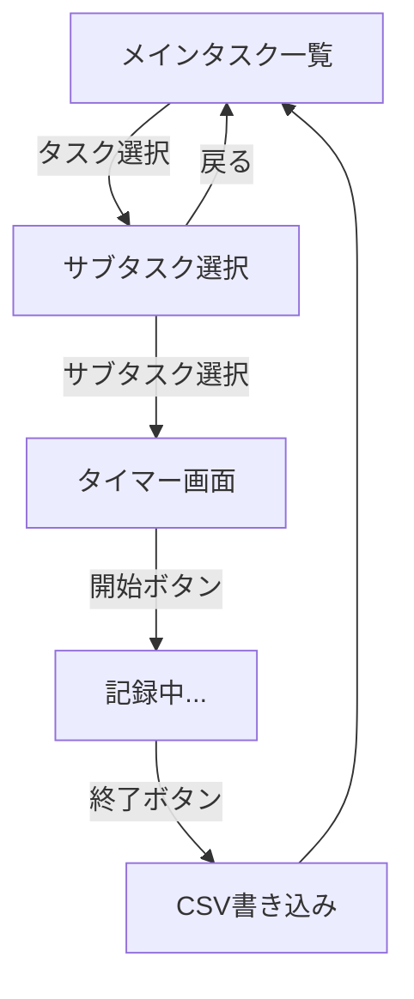

# タスクタイムスタンプ記録アプリ - 実装計画

シンプルなクリック操作でタスクの開始/終了時間を記録するデスクトップアプリ。Togglの「UIが重い」「毎回開くのが面倒」という課題を解決。

## User Review Required

> [!IMPORTANT]
> **技術スタック**: Python + tkinter を推奨します。理由: 
> - 標準ライブラリで依存関係が少ない
> - PyInstallerでのexe化が安定している
> - フローティングウィンドウの実装が容易

> [!IMPORTANT]
> **サブタスクの固定値について**  
> 以下のサブタスクを初期設定として実装します。変更・追加があればお知らせください:
> - 図面チェック
> - 成果品策定
> - 電話対応
> - メール対応
> - 打ち合わせ
> - 資料作成
> - その他

> [!IMPORTANT]
> **メインタスクリストの管理方法**  
> 案1: JSONファイルで管理（アプリ内で追加/削除可能）  
> 案2: CSVファイルで管理（外部エディタで編集）  
> →**案1を推奨**（直感的な操作のため）

---

## Proposed Changes

### プロジェクト構造

```
spatial-protostar/
├── src/
│   ├── main.py              # エントリーポイント
│   ├── ui/
│   │   ├── __init__.py
│   │   ├── main_window.py   # メインタスク一覧画面
│   │   ├── subtask_window.py # サブタスク選択画面
│   │   └── timer_window.py  # 開始/終了ボタン画面
│   ├── models/
│   │   ├── __init__.py
│   │   └── task.py          # タスクデータモデル
│   ├── services/
│   │   ├── __init__.py
│   │   ├── csv_writer.py    # CSV書き込み
│   │   └── task_manager.py  # タスク管理
│   └── config/
│       ├── __init__.py
│       └── settings.py      # 設定管理
├── data/
│   └── main_tasks.json      # メインタスクリスト
├── build.spec               # PyInstaller設定
├── requirements.txt
└── README.md
```

---

### Core - エントリーポイント

#### [NEW] [main.py](file:///c:/Users/luvsi/.gemini/antigravity/playground/spatial-protostar/src/main.py)
- tkinterアプリの初期化
- フローティングウィンドウ設定（常に最前面、ドラッグ移動可能）
- 小さめのウィンドウサイズ（300x400程度）

---

### UI - 画面コンポーネント

#### [NEW] [main_window.py](file:///c:/Users/luvsi/.gemini/antigravity/playground/spatial-protostar/src/ui/main_window.py)
- メインタスク一覧表示（ボタン形式）
- タスク追加/削除機能
- 設定ボタン

#### [NEW] [subtask_window.py](file:///c:/Users/luvsi/.gemini/antigravity/playground/spatial-protostar/src/ui/subtask_window.py)
- サブタスク一覧（固定値）をボタンで表示
- 選択したメインタスク名を表示
- 戻るボタン

#### [NEW] [timer_window.py](file:///c:/Users/luvsi/.gemini/antigravity/playground/spatial-protostar/src/ui/timer_window.py)
- 大きな「開始」ボタン（押すと「終了」に変化）
- 現在時間のリアルタイム表示
- 記録された開始時間の表示
- 終了ボタン押下でCSV書き込み→メイン画面に戻る

---

### Services - ビジネスロジック

#### [NEW] [csv_writer.py](file:///c:/Users/luvsi/.gemini/antigravity/playground/spatial-protostar/src/services/csv_writer.py)
- CSV形式: `日付,メインタスク,サブタスク,開始時間,終了時間,作業時間(分)`
- ユーザー指定フォルダへの出力
- ファイル名: `timestamp_YYYYMM.csv`（月別）

#### [NEW] [task_manager.py](file:///c:/Users/luvsi/.gemini/antigravity/playground/spatial-protostar/src/services/task_manager.py)
- メインタスクの追加/削除/保存
- JSONファイルとの同期

---

### Config - 設定管理

#### [NEW] [settings.py](file:///c:/Users/luvsi/.gemini/antigravity/playground/spatial-protostar/src/config/settings.py)
- 出力フォルダパス
- サブタスク一覧（将来的なカスタマイズ用）
- ウィンドウ位置の記憶

---

## 画面フロー



---

## Windows Defender誤検知対策

1. **PyInstaller設定の最適化**
   - `--onefile`ではなく`--onedir`を使用（誤検知リスク低減）
   - UPX圧縮を無効化（`--noupx`）
   
2. **コード署名**（推奨だが必須ではない）
   - 自己署名証明書での署名も一定の効果あり

3. **VirusTotalでの事前チェック**
   - ビルド後に確認を推奨

---

## Verification Plan

### 自動テスト
現時点では単純なGUIアプリのため、自動テストは最小限:
```bash
cd c:\Users\luvsi\.gemini\antigravity\playground\spatial-protostar
python -m pytest tests/ -v
```
- CSV書き込み機能の単体テスト
- タスクマネージャーの単体テスト

### 手動検証
1. **基本フローの確認**
   - アプリ起動 → メインタスク選択 → サブタスク選択 → 開始 → 終了
   - CSVファイルに正しくデータが記録されているか確認

2. **フローティングウィンドウの確認**
   - 常に最前面に表示されるか
   - ドラッグで移動できるか
   - 適切なサイズか

3. **exe動作確認**
   ```bash
   pyinstaller build.spec
   dist\TaskTimestamp\TaskTimestamp.exe
   ```
   - exeが正常に起動するか
   - Windows Defenderに検出されないか

---

## 質問事項

1. **サブタスクのカスタマイズ**は必要ですか？（初期版では固定値を推奨）
2. **起動時に自動で最前面**にするか、**タスクバーに常駐**させるか？
3. **CSV出力先のデフォルトフォルダ**はどこが良いですか？（例: Documents/TaskTimestamp/）
